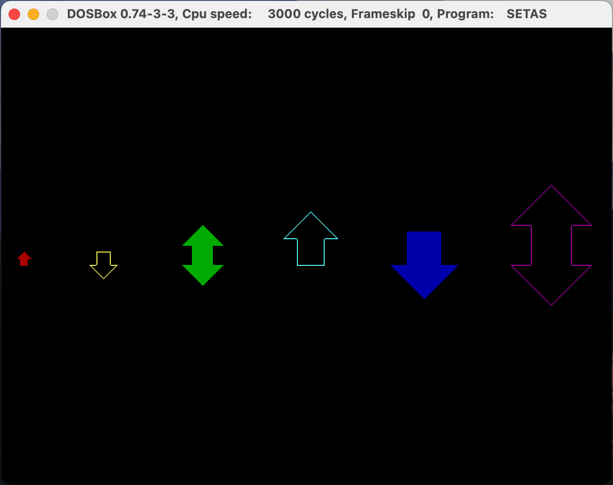

# Repositório de Sistemas Embarcados

## Requisitos

Download e instale [DosBox](https://www.dosbox.com/)

Abra o DosBox e monte a pasta do seu projeto

`mount -c \home\user\asm_x86`

`c:`

Como exemplo, usaremos o código [setas.asm](../setas.asm)

Montagem: `nasm setas`

Executável: `freelink setas`

Para executar: `setas.exe`

## TODOs

Em [painel.asm](../painel.asm): Corrigir e completar a implementacão dos ponteiros do painel.